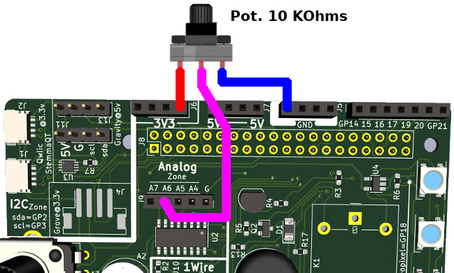

# Utilisation du Ludik-Hat en C

Cette section reprend l'utilisation du Ludik-Hat avec le langage C.

Les exemples utilise le compilateur G++. G++ est le compilateur C++ libre de la collection de compilateur GNU. Celui-ci est déjà installé sur le Raspberry-Pi.


La sérigraphie de la carte contient de nombreuses informations permettant d'identifier les GPIOs utilisés par les différents éléments.


# Installation

## Compilateur C++

Les [exemples](examples) utilisent le compilateur `g++` déjà présent sur RaspberryPi-OS. Le compilateur est utilisé conjointement à l'utilitaire `make` (voir [Makefile pour G++](https://earthly.dev/blog/g++-makefile/)) pour faciliter la compilation et génération de l'exécutable.

Vous pourrez trouver la [documentation de pigpio sur cette page](https://abyz.me.uk/rpi/pigpio/cif.html).

## pigpio - Contrôle des GPIOs
Etant donné que WiringPi n'est plus supporté, les codes d'exemples utilisent [pigpio](http://abyz.me.uk/rpi/pigpio/index.html) disposant d'un excellent support et par ailleurs super-rapide.

Avant d'utiliser `pigpio`, il faut démarrer le démon `pigpiod` qui gère les accès du GPIO.

``` bash
sudo pigpiod
```

Les programmes utilisateurs se connectent sur le démon pour manipuler les GPIOs.

Le petit script [gpiotest.sh](docs/gpiotest.sh) permet de tester rapidement le bon fonctionnement du démon `gpiod`. __Ne branchez pas le Ludik-Hat__ pendant l'exécution du script.

``` bash
$ ./gpiotest.sh
This program checks the Pi's (user) gpios.

The program reads and writes all the gpios.  Make sure NOTHING
is connected to the gpios during this test.

The program uses the pigpio daemon which must be running.

To start the daemon use the command sudo pigpiod.

Press the ENTER key to continue or ctrl-C to abort...

Testing...
Pull down on gpio 4 failed.
Pull up on gpio 5 failed.
Pull down on gpio 13 failed.
Skipped non-user gpios: 0 1 28 29 30 31
Tested user gpios: 2 3 4 5 6 7 8 9 10 11 12 13 14 15 16 17 18 19 20 21 22 23 24 25 26 27
Failed user gpios: 4 5 13
```


# Tester

Tous les exemples sont disponibles dans le sous-répertoire [c/examples](examples).

## Hello

Hello est un programme élémentaire accompagné d'un `Makefile` permettant sa compilation.

Pour créer l'exécutable saisissez les commandes suivantes dans un terminal:

```
$ cd examples/hello
$ make
```

Ce qui crée le fichier exécutable `hello` .

Pour tester l'exécutable saisissez simplement la commande suivante dans le terminal.

```
$ ./hello
Hello World!
```

Une fois le programme testé et compilé, l'appel à `make clean` permet d'effacer
les fichiers de compilation et l'exécutable.

## Hello2

Hello2 est un programme élémentaire accompagné d'une dépendance et son `Makefile`.

Le but de cet exemple est plutôt de se familiariser avec un fichier Mafefile plus grand.

## LEDs

Cet exemple très condensé permet allume et éteint la LED verte. Il n'y a pas de source pour cet exemple concis... voyez le second exemple qui fait clignoter toutes les LEDs.

``` c++
#include <stdio.h>
#include <pigpio.h>
#include <unistd.h> // sleep

int main(void){
	gpioInitialise();

	// GPIO 12 = LED Verte / Green LED
	gpioSetMode( 12, PI_OUTPUT );

  // allume - Switch on
	gpioWrite( 12, 1 );
  sleep( 1 );

	// eteindre - Switch off
	gpioWrite( 12, 0 );
}
```

Le code ci-dessous, visible dans [leds.cpp](examples/leds/leds.cpp) active les LEDs une à une (puis les éteints une à une).

``` c++
#include <stdio.h>
#include <pigpio.h>
#include <string>
#include <unistd.h> // sleep

#define NUM_LEDS 4

int GPIO_LEDS[4] = { 12, 26, 27, 6 };
std::string GPIO_NAMES[4] = {"Green", "Orange", "Red", "Yellow" };

int main(void){
	printf("Playing with LEDs!\n");
	gpioInitialise();
	gpioSetMode( 12, PI_OUTPUT );

	while( 1 ){
		// Allume les LEDs 1 à 1
		for( int i=0; i<NUM_LEDS; i++ ){
			printf("ON  %d : %s\n", i, GPIO_NAMES[i].data() );
			gpioWrite( GPIO_LEDS[i], 1 );
			sleep( 1 );
		}
		// Eteind les LEDs 1 à 1
		for( int i=0; i<NUM_LEDS; i++ ){
			printf("OFF %d : %s\n", i, GPIO_NAMES[i].data() );
			gpioWrite( GPIO_LEDS[i], 0 );
			sleep( 1 );
		}
	}
}
```

Une fois compilé et exécuté avec un __sudo__ les LEDs du LudikHat s'allume et s'éteignent a tour de rôle.

``` bash
$ make
g++ -c leds.cpp
g++ -Wall -o leds  -lpigpio -lrt -lpthread leds.o


$ sudo ./leds
Playing with LEDs!
ON  0 : Green
ON  1 : Orange
ON  2 : Red
ON  3 : Yellow
OFF 0 : Green
OFF 1 : Orange
OFF 2 : Red
OFF 3 : Yellow
ON  0 : Green
ON  1 : Orange
ON  2 : Red
ON  3 : Yellow
OFF 0 : Green
OFF 1 : Orange
OFF 2 : Red
OFF 3 : Yellow
ON  0 : Green
ON  1 : Orange
ON  2 : Red
ON  3 : Yellow
...
```

## Boutons

Le code ci-dessous, visible dans [buttons.cpp](examples/buttons/buttons.cpp) détecte l'état des boutons toutes les secondes.

``` c++
#include <stdio.h>
#include <pigpio.h>
#include <string>
#include <unistd.h> // sleep

#define NUM_BTNS 4

int GPIO_BTNS[NUM_BTNS] = { 22, 23, 24, 25 };
std::string GPIO_NAMES[NUM_BTNS] = {"Bnt1", "Btn2", "Btn3", "Btn4" };

int main(void){
	printf("Playing with Buttonss!\n");
	gpioInitialise();
	for( int i=0; i<NUM_BTNS; i++ ) {
		gpioSetMode( GPIO_BTNS[i], PI_INPUT );
		gpioSetPullUpDown( GPIO_BTNS[i],  PI_PUD_UP ); // Set PullUp
	}

	while( 1 ){
		// Allume les LEDs 1 à 1
		for( int i=0; i<NUM_BTNS; i++ ){
			int val = gpioRead( GPIO_BTNS[i] );
			printf("%s : %s\n", GPIO_NAMES[i].data(), val==1 ? "release" : "PRESSED" );
		}
		sleep( 1 );
		printf( "---------------------\n" );
	}
}
```

Une fois compilé et exécuté avec un __sudo__ les programme affiche l'état des boutons du LudikHat (une fois par seconde).

``` bash
$ make
g++ -c buttons.cpp
g++ -Wall -o buttons  -lpigpio -lrt -lpthread buttons.o
$ sudo ./buttons
Playing with Buttonss!
Bnt1 : release
Btn2 : PRESSED
Btn3 : release
Btn4 : release
---------------------
Bnt1 : release
Btn2 : PRESSED
Btn3 : release
Btn4 : release
---------------------
Bnt1 : PRESSED
Btn2 : release
Btn3 : release
Btn4 : release
---------------------
Bnt1 : release
Btn2 : release
Btn3 : PRESSED
Btn4 : PRESSED
---------------------
Bnt1 : release
Btn2 : release
Btn3 : release
Btn4 : release
...
```

## Potentiomètre et photo-résistance (analogique)

Les lectures analogiques se font par l'intermédiaire du composant MCP3008 présent sur la carte. Ce composant propose 8 entrées analogiques.


Le potentiomètre est branché sur le canal 3 (ch3), ce potentiomètre produit une tension entre 0 et 3.3V en fonction de la position de l'axe du potentiomètre.

La lecture analogique à l'aide de la classe `mcp3008Spi` retourne un nombre entier entre 0 (pour 0V) et 1023 (pour 3.3V).

Si la valeur retournée est 400 alors cela correspond à une tension de 3.3V * 400/1023 = 1.29V.


### Lecture du potentiomètre

L'exemple [analog.cpp](examples/analog/analog.cpp) permet de lire l'état du potentiomètre sur l'entrée 3 du MCP3008.

Le programme effectue 200 lectures puis s'arrête.

``` c++
#include <stdio.h>
#include <unistd.h> // usleep()
#include "mcp3008Spi.h"

using namespace std;

#define DELAY_MS 200
#define POT_ADC_INPUT 3
#define LDR_ADC_INPUT 2

// Entrée du MCP3008 à lire - entry to read on the MCP3008
#define ADC_CHANNEL POT_ADC_INPUT

int main(void) {
		mcp3008Spi adc("/dev/spidev0.0", SPI_MODE_0, 1000000, 8);
		int i = 200;

		while(i > 0) {
			int val = adc.read( ADC_CHANNEL ); // read channel 3 -- Potentiometer
			printf( "Read %i/200: ADC ch%d = %d\n", (200-i), ADC_CHANNEL, val );
			usleep( DELAY_MS * 1000 );
			i--;
		}
		return 0;
}
```

La valeur retournée par la méthode `read()` est comprise entre 0 et 1023.

``` bash
$ make
g++ -c mcp3008Spi.cpp
g++ -c analog.cpp
g++ -Wall -o analog  -lpigpio -lrt -lpthread mcp3008Spi.o analog.o
$ ./analog
Read 0/200: ADC ch3 = 356
Read 1/200: ADC ch3 = 356
...
Read 23/200: ADC ch3 = 356
Read 24/200: ADC ch3 = 390
Read 25/200: ADC ch3 = 560
Read 26/200: ADC ch3 = 756
Read 27/200: ADC ch3 = 880
Read 28/200: ADC ch3 = 969
Read 29/200: ADC ch3 = 1023
Read 30/200: ADC ch3 = 1023
Read 31/200: ADC ch3 = 1023
Read 32/200: ADC ch3 = 1023
Read 33/200: ADC ch3 = 838
Read 34/200: ADC ch3 = 662
Read 35/200: ADC ch3 = 506
...
```

### Lecture de la Photo-Résistance

La photo-résistance peut être testé avec le programme d'exemple [analog.cpp](examples/analog/analog.cpp), il suffit de remplacer la ligne:

``` c++
// Entrée du MCP3008 à lire - entry to read on the MCP3008
#define ADC_CHANNEL POT_ADC_INPUT
```

avec

``` c++
// Entrée du MCP3008 à lire - entry to read on the MCP3008
#define ADC_CHANNEL LDR_ADC_INPUT
```

ce qui produit le résultat suivant:

``` c++
$ make
g++ -c analog.cpp
g++ -Wall -o analog  -lpigpio -lrt -lpthread mcp3008Spi.o analog.o
$ ./analog
Read 0/200: ADC ch2 = 803
Read 1/200: ADC ch2 = 804
Read 2/200: ADC ch2 = 803
Read 3/200: ADC ch2 = 803
Read 4/200: ADC ch2 = 803
Read 5/200: ADC ch2 = 803
Read 6/200: ADC ch2 = 802
Read 7/200: ADC ch2 = 803
Read 8/200: ADC ch2 = 802
Read 9/200: ADC ch2 = 800
Read 10/200: ADC ch2 = 800
Read 11/200: ADC ch2 = 800
Read 12/200: ADC ch2 = 798
Read 13/200: ADC ch2 = 796
Read 14/200: ADC ch2 = 788
Read 15/200: ADC ch2 = 742
Read 16/200: ADC ch2 = 621
Read 17/200: ADC ch2 = 611
Read 18/200: ADC ch2 = 564
Read 19/200: ADC ch2 = 385
Read 20/200: ADC ch2 = 293
Read 21/200: ADC ch2 = 255
...
Read 53/200: ADC ch2 = 235
Read 54/200: ADC ch2 = 225
Read 55/200: ADC ch2 = 213
Read 56/200: ADC ch2 = 203
Read 57/200: ADC ch2 = 206
...
```

Le cas de la photo-résistance (LDR) est un peu différent: sa résistance augmente lorsque la lumière diminue (et résistance diminue lorsque la lumière augmente).

Comme un MCP3008 n'est pas capable de lire une résistance, on constitue un pont diviseur de tension avec une résistance de 10 KOhms. Il y a donc un courant qui traverse la photo-résistance + R 10K. Ce courant n'est pas figé, il change puisque la résistance de la photo-résistance change en fonction des conditions lumineuses.

Le canal 2 permet de relever la tension aux bornes de la résistance de 10K qui dépend du courant qui la traverse, courant qui lui-même dépend de la résistance de la photo-résistance (qui dépend la lumière).

__La valeur sur l'ADC augmente si la lumière augmente -et- diminue si la lumière diminue__.

__Remarques__:
* Chaque photo-résistance est différente. Les tensions relevées sont donc sensiblement différentes pour chaque montage.
* Ne touchez pas la photo-résistance avec le doigt car cela modifie aussi sa résistance!

## Joystick

Les sorties analogiques du joystick sont branchés sur les entrées 0 et 1 du MCP3008.

Le joystick est à mi-parcours des résistance en position de repos.

La valeur des l'ADC pour le joystick au repos est de 512 (approximativement). Sinon, la valeur évolue de 0 à 1024 pour le parcours du joystick d'un côté de l'axe au côté opposé.

``` bash
$ make
g++ -c joy.cpp
g++ -c mcp3008Spi.cpp
g++ -Wall -o joystick  -lpigpio -lrt -lpthread joy.o mcp3008Spi.o
$ joystick
-bash: joystick : commande introuvable
$ ./joystick
Vert 505 : Horz 507
Vert 505 : Horz 507
Vert 505 : Horz 507
Vert 505 : Horz 507
Vert 505 : Horz 507
Vert 505 : Horz 507
Vert 506 : Horz 507
Vert 359 : Horz 507
Vert 0 : Horz 383
Vert 0 : Horz 384
Vert 0 : Horz 383
Vert 0 : Horz 384
Vert 0 : Horz 390
Vert 0 : Horz 398
Vert 0 : Horz 398
Vert 0 : Horz 399
Vert 300 : Horz 420
Vert 506 : Horz 507
Vert 505 : Horz 507
Vert 872 : Horz 507
Vert 1023 : Horz 480
Vert 1023 : Horz 476
Vert 1023 : Horz 477
Vert 1023 : Horz 476
Vert 1023 : Horz 476
Vert 1023 : Horz 476
Vert 972 : Horz 476
Vert 505 : Horz 507
Vert 505 : Horz 507
Vert 505 : Horz 507
Vert 505 : Horz 507
Vert 579 : Horz 0
Vert 690 : Horz 0
Vert 749 : Horz 0
Vert 775 : Horz 57
Vert 775 : Horz 203
Vert 745 : Horz 507
Vert 676 : Horz 797
Vert 665 : Horz 863
Vert 665 : Horz 1023
Vert 665 : Horz 1023
Vert 667 : Horz 1023
Vert 662 : Horz 904
Vert 506 : Horz 507
Vert 506 : Horz 507
...
```

## Entrées analogiques supplémentaires

Les 4 entrées analogiques encore disponibles sur le MCP3008 restent à disposition et porte les numéros A4 à A7 (correspondant aux canaux 4 à 7).


Celles-ci peuvent donc être utilisées avec du matériel analogique (comme des potentiomètres). __Attention à ne jamais dépasser 3.3V sur une entrée analogique.__

L'exemple ci-dessous permet de relever la tension analogique sur l'entrée A6 (canal 6 du MCP3008).



L'entrée analogique A6 peut être testé avec le programme d'exemple [analog.cpp](examples/analog/analog.cpp), il suffit de remplacer la ligne:

``` c++
// Entrée du MCP3008 à lire - entry to read on the MCP3008
#define ADC_CHANNEL POT_ADC_INPUT
```

avec

``` c++
// Entrée du MCP3008 à lire - entry to read on the MCP3008
#define ADC_CHANNEL 6
```

Ce qui permettra de lire l'entrée analogique.

## Capteur de température DS18B20 (1-Wire)

Lorsque le support 1-Wire est activé dans le menu interface du Raspberry-Pi (voir utilitaire `raspi-config`) alors les périphériques 1-Wire sont accessibles par l'intermédiaire du système de fichiers à l'emplacement `/sys/bus/w1/devices/28-00*/w1_slave` .

Le programme [read_ds18b20.cpp](examples/ds18b20/read_ds18b20.cpp) :
1. liste les sondes DS18B20 connectées sur le bus 1Wire
2. sélectionne la première sonde trouvée
3. Lit la température 1 fois par seconde

Il s'agit principalement d'accès fichiers! La seule subtilité réside au niveau du pointer `w1_addr` (pointeur vers une chaîne de caractères).

`w1_addr` permet d'identifier l'adresse 1Wire (un nom de fichier) sélectionnée pour lire la température.

``` c++
#include <iostream>
#include <stdio.h>
#include <string>
#include <unistd.h> // sleep
#include "ds18b20.h"

#include <glob.h>

using namespace std;

char sys_path[] = "/sys/bus/w1/devices/28-00*";

char *w1_addr = NULL; // The DS18B20 1Wire address in 16 char len

int main(void){
	printf("Enumerate DS18B20 sensors!\n");
	glob_t glob_result;
	glob(sys_path ,GLOB_TILDE,NULL,&glob_result);
	for(unsigned int i=0; i<glob_result.gl_pathc; ++i){
		if( w1_addr==NULL ){
			printf( "   %s [SELECTED]\n", basename( glob_result.gl_pathv[i] ) );
			w1_addr =  basename(glob_result.gl_pathv[i]);
		} else {
			printf( "   %s \n", basename( glob_result.gl_pathv[i] ) );
		}
	}

	if( w1_addr == NULL ){
		printf("Oups! no DS18B20 detected!");
		return 0;
	}

	printf(" ");
	printf("Read temperature from %s\n", w1_addr);
	double tempNow;
	DS18B20 w1Device1( w1_addr );
	while(1){
		tempNow = w1Device1.getTemp();
		printf( "   temperature: %f degrees Celsius\n", tempNow );
		sleep(1);
	}

	return 0;
}
```

Voici le résultat produit par le programme lorsque l'on place le doigts dessus.

``` bash
$ make
g++ -c ds18b20.cpp
g++ -c read_ds18b20.cpp
g++ -Wall -o read_ds18b20  -lpigpio -lrt -lpthread ds18b20.o read_ds18b20.o

$ ./read_ds18b20
Enumerate DS18B20 sensors!
   28-00000d19fe94 [SELECTED]
 Read temperature from 28-00000d19fe94
   temperature: 23.437000 degrees Celsius
   temperature: 23.437000 degrees Celsius
   temperature: 24.375000 degrees Celsius
   temperature: 25.375000 degrees Celsius
   temperature: 26.000000 degrees Celsius
   temperature: 26.375000 degrees Celsius

```

## Relais

ToDo

## Buzzer

ToDo

## NeoPixel

ToDo

## Ecran OLED ????

ToDo ????

# Ressources
* [pigpio](http://abyz.me.uk/rpi/pigpio/index.html)
* [create Makefile for G++](https://earthly.dev/blog/g++-makefile/)
