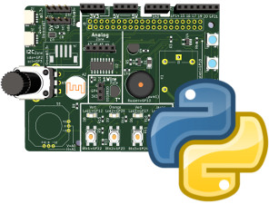
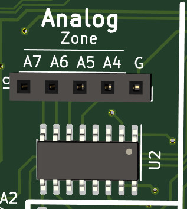
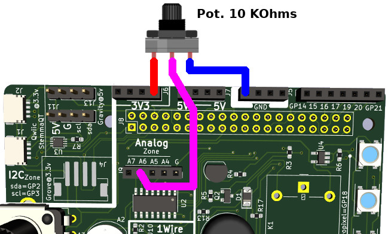
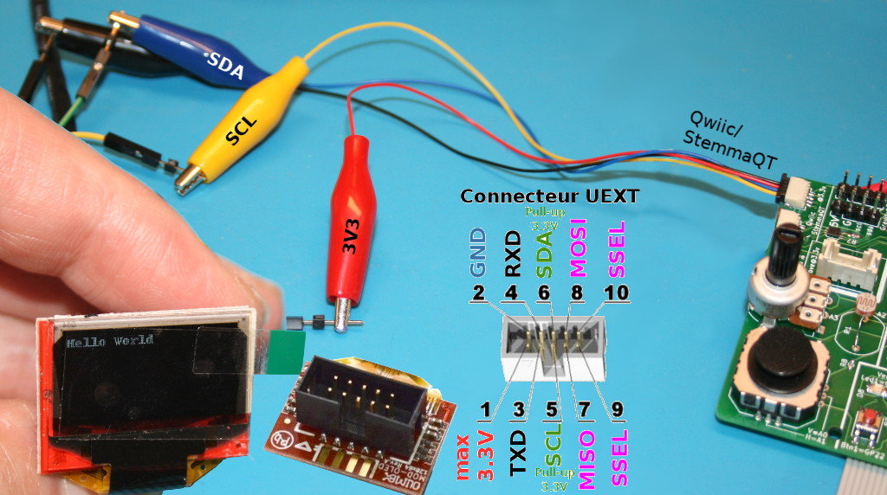

# Utilisation du Ludik-Hat avec Python3

Cette section reprend l'utilisation du Ludik-Hat avec le langage Python3.

La sérigraphie de la carte contient de nombreuses informations permettant d'identifier les GPIOs utilisés par les différents éléments.



# Installation
Le Ludik-Hat utilise la bibliothèque python `rpi_ws281x` et `gpiozero`.

```
sudo pip install rpi_ws281x
sudo pip3 install rpi_ws281x

```

`gpiozero` est déja installé avec le système d'exploitation Raspberry-Pi OS.

# Tester

Tous les exemples sont disponibles dans le sous-répertoire [python/examples](python/examples).

Les différentes exemples peuvent être testés avec la syntaxe `python3 nom_du_fichier.py`

Ex: `python3 leds.py`

## LEDs

L'exemple [leds.py](examples/leds.py) fait clignoter les 4 LEDs tour à tour.

Le code ci-dessous montre comment commander la LED orange.

``` python
import gpiozero as g

GPIO_RED    = 12 # LED rouge
GPIO_ORANGE = 26 # LED orange
GPIO_GREEN  = 27 # LED verte
GPIO_YELLOW = 6  # LED jaune

orange = g.LED( GPIO_ORANGE )

orange.on()
```

## Boutons

L'exemple [buttons.py](examples/buttons.py) permet de détecter la pression sur les différents boutons présents sur la carte.

Le code ci-dessous détecte la pression sur le bouton 4.

``` python
import gpiozero as g
import time

GPIO_BTN1 = 22
GPIO_BTN2 = 23
GPIO_BTN3 = 24
GPIO_BTN4 = 25

btn4 = g.Button( GPIO_BTN4 )

while True:
	if btn4.is_pressed:
		print( "Btn4 pressé" )
	time.sleep(0.100)
```

## Potentiomètre et photo-résistance (analogique)

Les lectures analogiques se font par l'intermédiaire du composant MCP3008 présent sur la carte. Ce composant propose 8 entrées analogiques.


Le potentiomètre est branché sur le canal 3 (ch3), ce potentiomètre produit une tension entre 0 et 3.3V en fonction de la position de l'axe du potentiomètre.

La lecture analogique à l'aide de `gpiozero` retourne un nombre réelle entre 0 (pour 0V) et 1 (pour 3.3V).

Si la valeur retournée est 0.5 alors cela correspond à une tension de 3.3V * 0.5 = 1.65V. Une petite astuce mathématique permet également de transformer la valeur du convertisseur vers une valeur entière entre 0 et 1024.

L'exemple [analog.py](examples/analog.py) permet de lire l'état du potentiomètre et de la photo-résistance présents sur la carte.

### Lecture du potentiomètre

``` python
import gpiozero as g
import time, math

pot = g.MCP3008( channel=3, device=0 )

while True:
	pot_volt  = pot.value * 3.3
	pot_value = math.trunc(pot.value * 1024)
	print( "pot= %f volts, pot=%4i" % (pot_volt, pot_value) )
	time.sleep(0.200)
```

### Lecture de la Photo-Résistance

Le cas de la photo-résistance (LDR) est un peu différent: sa résistance augmente lorsque la lumière diminue (et résistance diminue lorsque la lumière augmente).

Comme un MCP3008 n'est pas capable de lire une résistance, on constitue un pont diviseur de tension avec une résistance de 10 KOhms. Il y a donc un courant qui traverse la photo-résistance + R 10K. Ce courant n'est pas figé, il change puisque la résistance de la photo-résistance change en fonction des conditions lumineuses.

Le canal 2 permet de relever la tension aux bornes de la résistance de 10K (qui dépend du courant qui la traverse, qui lui-même dépend de la résistance de la photo-résistance (qui dépend la lumière).

Cette tension est d'environ 3V à pleine luminosité et 1.25V dans le noir complet.

``` python
import gpiozero as g
import time, math

ldr = g.MCP3008( channel=2, device=0 )

while True:
	ldr_value = math.trunc(ldr.value * 1024)
	print( "ldr=%4i" % ldr_value )
	time.sleep(0.200)
```

__Remarques__:
* Chaque photo-résistance est différente. Les tensions relevées sont donc sensiblement différentes pour chaque montage.
* Ne touchez pas la photo-résistance avec le doigt car cela modifie aussi sa résistance!
* Transformer la valeur du canal 2 (channel 2) en valeur entière entre 0 et 1024 facilitera la lecture discriminative. C'est autrement plus facile d'une valeur décimale entre 0 et 1 avec laquelle notre cerveau à plus de mal.

## Joystick

Le joystick analogique se comporte comme deux potentiomètres (un vertical et un horizontal) dont les valeurs respectives dépendent de la position du joystick.

Le joystick est branché sur les canaux 0 et 1 du MCP3008 (voir schéma ci-dessus).

L'exemple [joystick.py](examples/joystick.py) permet de lire l'état des deux axes du joystick.

Comme les autres entrées analogiques, ces valeurs décimales vont de 0 à 1 (avec une valeur médiane de ~0.5 lorsque le joystick est au centre). Pour faciliter la lecture de ces informations, le script affiche un résultat entre 0 et 1024 pour chaque axe.

``` python
import gpiozero as g
import time, math

vert = g.MCP3008( channel=1, device=0 )
horz = g.MCP3008( channel=0, device=0 )

while True:
	v = math.trunc(vert.value * 1024)
	h = math.trunc(horz.value * 1024)
	print( "Joystick H=%4i, V=%4i" % (h,v) )
	time.sleep(0.200)
```

La position verticale est relevée sur le canal 1 tandis que la position horizontale est relevée sur le canal 0.

## Entrées analogiques supplémentaires

Les 4 entrées analogiques encore disponibles sur le MCP3008 restent à disposition et porte les numéros A4 à A7 (correspondant aux canaux 4 à 7).



Celles-ci peuvent donc être utilisées avec du matériel analogique (comme des potentiomètres). __Attention à ne jamais dépasser 3.3V sur une entrée analogique.__

L'exemple ci-dessous permet de relever la tension analogique sur l'entrée A6 (canal 6 du MCP3008).



``` python
import gpiozero as g
import time

a6 = g.MCP3008( channel=6, device=0 )

while True:
	volts = a6.value * 3.3
	print( "A6=%f volts" % volts )
	time.sleep(0.200)
```

L'exemple [analog_inputs.py](examples/analog_inputs.py) permet de lire les entrées analogiques A4 à A7 (avec afficahge des valeurs de 0 à 1024).

## Capteur de température DS18B20 (1-Wire)

Ce test lit la température depuis le capteur DS18B20 présent sur la carte.

Si plusieurs capteurs sont présents sur le bus 1-Wire alors il est également possible de lire tous les capteurs présents. Ceux-cis sont alors identifiable par leur ROM.

Le fichier d'exemple [test_ds18b20.py](examples\test_ds18b20.py) contient une classe `DS18B20` facilitant l'accès aux capteurs.

```
--- Read onboard DS1820 temperature ---
Iteration 0: 25.000 Celcius
Iteration 1: 25.062 Celcius
Iteration 2: 25.000 Celcius
Iteration 3: 25.000 Celcius
Iteration 4: 24.937 Celcius
--- Read all DS1820 sensors on the 1-Wire bus ---
Iteration: 0
    >>> ROM: 8e 01 55 05 7f a5 a5 66 59, Temp: 24.875 Celsius
    >>> ROM: 6e 01 4b 46 7f ff 02 10 71, Temp: 22.875 Celsius
Iteration: 1
    >>> ROM: 8d 01 55 05 7f a5 a5 66 9c, Temp: 24.812 Celsius
    >>> ROM: 6e 01 4b 46 7f ff 02 10 71, Temp: 22.875 Celsius
Iteration: 2
    >>> ROM: 8b 01 55 05 7f a5 a5 66 0f, Temp: 24.687 Celsius
    >>> ROM: 6e 01 4b 46 7f ff 02 10 71, Temp: 22.875 Celsius
Iteration: 3
    >>> ROM: 8b 01 55 05 7f a5 a5 66 0f, Temp: 24.687 Celsius
    >>> ROM: 6d 01 4b 46 7f ff 03 10 70, Temp: 22.812 Celsius
Iteration: 4
    >>> ROM: 89 01 55 05 7f a5 a5 66 89, Temp: 24.562 Celsius
    >>> ROM: 6e 01 4b 46 7f ff 02 10 71, Temp: 22.875 Celsius
```

## Relais

Le relais du Ludik HAT est branché sur le GPIO 5.

Son activation est relativement rudimentaire comme le démontre le contenu de l'exemple [relay.py](docs/_static/relay.py) .

``` python
import gpiozero as g
import time

RELAYS_GPIO = 5

rel = g.DigitalOutputDevice( RELAYS_GPIO )

while True:
	rel.on()
	time.sleep( 1 )
	rel.off()
	time.sleep( 1 )
```

## Buzzer

L'exemple [buzzer.py](examples/buzzer.py) joue une gamme Do, Ré, Mi, Fa, Sol, La, Si, Do en utilisant la classe `TonalBuzzer` de la bibliothèque `gpiozero`.

``` python
import gpiozero as g
import time

BUZZER_GPIO = 13

buz = g.TonalBuzzer( BUZZER_GPIO )

buz.play('C4') # Do
time.sleep( 1 )

buz.play('D4') # Re
time.sleep( 1 )

buz.stop()
```

## NeoPixel

La carte est équipées de 4 led NeoPixel adressable (WS2812) commandable via une broche de donnée (GPIO 18).

L'utilisation des LEDs NéoPixels nécessite l'installation du module python `rpi_ws281x` (voir section "installation").

Les exemples [neopixel_simple.py](examples/neopixel_simple.py) et [neopixels.py](examples/neopixels.py) __doivent être exécutés avec "sudo python3"__.

``` python
from rpi_ws281x import Color, PixelStrip, ws


# Configuration des NeoPixels:
LED_COUNT = 4          # Nbre de Pixels.
LED_PIN = 18           # GPIO utilisé pour la transmission des données (doit supporter PWM!).
LED_FREQ_HZ = 800000   # Vitesse du bys (habituellement 800khz)
LED_DMA = 10           # Canal DMA à utiliser (essayer le 10)
LED_BRIGHTNESS = 255   # Luminosité: 0 pour minimum et 255 pour le maximum
LED_INVERT = False     # True pour inverser le signal (si un transistor est utilisé comme level shifter)
LED_CHANNEL = 0
LED_STRIP = ws.WS2812_STRIP

# Programme principal:
if __name__ == '__main__':
    # Créer l'objet NeoPixel.
    strip = PixelStrip(LED_COUNT, LED_PIN, LED_FREQ_HZ, LED_DMA, LED_INVERT, LED_BRIGHTNESS, LED_CHANNEL, LED_STRIP)
    # Initialiser la bibliothèque.
    strip.begin()

    strip.setPixelColor( 0, Color(255,0,0)) # Rouge
    strip.setPixelColor( 1, Color(0,255,0)) # Vert
    strip.setPixelColor( 2, Color(0,0,255)) # Bleu
    strip.setPixelColor( 3, Color(255,255,255)) # Blanc

    strip.show() # envoyer vers les pixels
```

Pour exécuter l'exemple, utiliser: `sudo python3 neopixel_simple.py`

Note: si vous obtenez le message "`RuntimeError: ws2811_init failed with code -5 (mmap() failed) Erreur de segmentation`" c'est que script n'a pas été exécuté avec un "__sudo__".

# Ecran OLED I2C

Dans l'exemple suivant, nous allons tester un écran OLED 128x64 pixels (3.3V, I2C).

Il s'agit de l'[écran OLED d'Olimex](https://shop.mchobby.be/product.php?id_product=1411) branché sur l'un des port I2C Qwiic/StemmaQt du Ludik Hat à l'aide d'un [câble de raccordement crocodile JST-SH](https://shop.mchobby.be/product.php?id_product=2113).



La bibliothèque Adafruit_Python_SSD1306 sera utilisée pour manipuler le contenu de l'afficheur.

## installation

```
cd ~
git clone https://github.com/adafruit/Adafruit_Python_SSD1306.git
cd Adafruit_Python_SSD1306
sudo python3 setup.py install

sudo pip3 install Adafruit_BBIO
sudo pip3 install pillow
```

## Utilisation

Les quelques lignes suivantes peuvent être saisies dans un interpréteur Python3.

``` python
import Adafruit_SSD1306
from PIL import Image, ImageDraw, ImageFont
disp = Adafruit_SSD1306.SSD1306_128_64(rst=None)

# Initialise l'écran - init display
disp.begin()

# Efface l'écran - Clear display.
disp.clear()
disp.display()


width = disp.width
height = disp.height
image = Image.new('1', (width, height))

# On créé un objet sur lequel on va dessiner
draw = ImageDraw.Draw(image)

# Charge la font par défaut
font = ImageFont.load_default()

# On écrit du texte dans le coin de l'écran en blanc- Draw some text
draw.text((0,0), 'Hello World', font=font, fill=255)

# Actualise l'affichage
disp.image(image)
disp.display()
```

Le code est disponible dans le fichier d'exemple [oled.py](examples/oled.py)

# Ressources
* [Ludik-Hat](https://shop.mchobby.be/fr/pi-hats/2114-ludik-hat-un-hat-pour-decouvrir-l-electronique-et-la-programmation-sur-raspberry-pi-3232100021143.html) @ MCHobby
