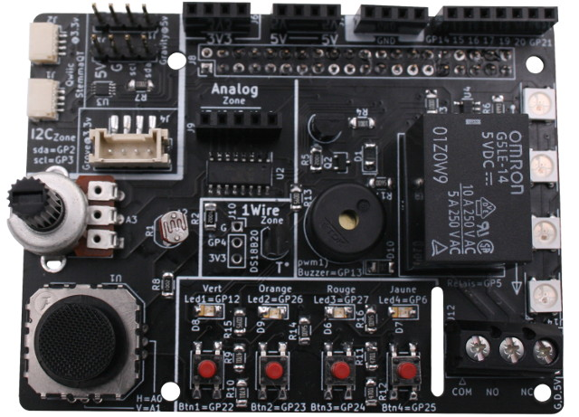

# Ludik-Hat

Ludik HAT est un HAT pour Raspberry-Pi destiné a apprendre l'électronique et la programmation sans avoir à sortir les fils, la plaque de prototypage ou le fer à souder.



Branchez le sur votre Raspberry-Pi puis commencez à expérimenter... laissons le prototypage électronique à plus tard :-)


Le Ludik-Hat à est prévu pour être programmer avec:
* Python,
* Scratch,
* C,
* MicroPython.

Ce projet est le fruit de la collaboration de [François Mocq (Framboise314)](https://www.framboise314.fr/bientot-une-carte-multifonction-pour-le-raspberry-pi/) et [MCHobby](https://shop.mchobby.be).


Ludik-HAT est réalisé dans l'esprit Open-Source, le schéma est accessible ainsi qu'une documentation complète.

# Installation

Avant de pouvoir utiliser le Ludik-Hat, il est nécessaire de configurer votre Raspberry-Pi pour qu'il puisse communiquer avec les différents de la carte.

## Activation du bus SPI, I2C et 1-Wire
1. Démarrer raspi config avec `sudo-raspi-config`
2. Sélectionner l'option __5 "interfacing options"__
 1. Sélectionner l'option __P4 SPI__ et activer le bus SPI
 2. Sélectionner l'option __P6 I2C__ et activer le bus I2C
 3. Sélectionner l'option __P7 1-Wire__ et activer le bus 1-Wire

## Redémarrer votre Raspberry-Pi

Utiliser la commande `sudo reboot`dans un terminal pour redémarrer le Raspberry-Pi

# Utiliser Ludik-Hat

Les liens ci-dessous renvoient vers les différentes documentations:
* [Utiliser Ludik-Hat avec Python](python/readme.md)
* Utiliser Ludik-Hat avec Scratch __à faire__
* [Utiliser Ludik-Hat avec C](c/readme.md)
* Utiliser Ludik-Hat avec MicroPython __à faire__

# Ressources
## DS18B20 : le capteur de température 1-Wire

Les capteurs 1-Wire DS18B20 sont supportés par Raspberry-Pi OS lui-même.
Si vous connectez un capteur DS18B20 et indiquez à Raspberry-Pi OS qu'il est là alors la température est lue par les tâches du système d'exploitation (comme lorsqu'une clé USB est connectée sur le système).

Si le pilote 1-Wire est bien actif et que la carte Ludik-HAT est branchée sur le GPIO alors le répertoire `/sys/bus/w1/devices/` doit  contenir un sous répertoire commençant par `28-``

Saisir la commande `ls /sys/bus/w1/devices/ | grep 28-*` devrait retourner un résultat similaire à celui-ci:

```
$ ls /sys/bus/w1/devices/ | grep 28-*
28-00000d19eaab
```

## Schéma de la carte

Le schéma de la carte est disponible dans le fichier [ludik-hat-schematic.pdf](docs/_static/ludik-hat-schematic.pdf)


# Liste d'achat

* [Ludik-Hat](https://shop.mchobby.be/fr/pi-hats/2114-ludik-hat-un-hat-pour-decouvrir-l-electronique-et-la-programmation-sur-raspberry-pi-3232100021143.html) @ MCHobby
